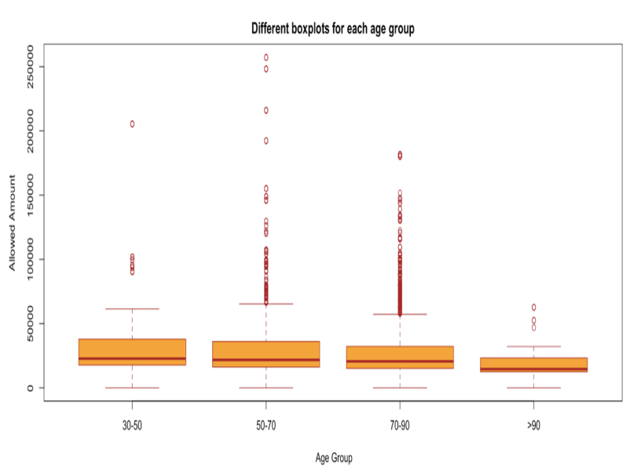

```{r setup, include=FALSE}
knitr::opts_chunk$set(echo = TRUE)
```

# Introduction(--Tong)
Our industry partner,Trinity Partners, a global life sciences strategic consulting company,would like to identify unmet market needs and to characterize patients, providers and payers dynamics.Trinity would like us to improve the analytic rigor,there is a need to advance their knowledge of data and to explore the use of new methodologies.We will show the results as a unique blend of concept and theory balanced by a pragmatic,bottom-line driven and data-tested analytic orientation.

### Data Source(--Tong)
Our group focused on cost distribution and drivers among CMS patients. We use the data from patients with Percutaneous Coronary Intervention and Coronary artery bypass graft surgery in 2018-2019. The data is a random sample of patients from all 50 states. Cost information from claims is  the interest to our client to understand financial burden of disease. The goal of this exploration is to obtain an understanding of the overall distribution of cost, as well as to assess how cost vary by states. Hope to provide insights into cost drivers and facilitate future data analysis.

### Method(--First three by Tong)
Firstly,we separated the age into four groups  and analyzed allowed amount according to them. We found the average allowed amount decreases with the increasing ages.

We also made another box-plot to show the distribution of the length of days between Admission_Date and Discharge_Date for each state and we found that the average of the length of days were basically the same for each state, except some state like Pennsylvania had a little higher level. Also within each state, there was still many anomaly points showing the longer length of days compared with the average.

According to the US map, we ordered our data by Patient_ID and Service_Year, then we grouped the ordered data with Patient_ID, Service_Year and State_Code in order to illustrate the average cost by person by year. We summed the amount of Charges by person by year (2018 & 2019), which means one person might be charged by different procedures and here we cared about the total charges for each person. From the maps we found that in 2018 Texas had the highest level of charges and in 2019 each state might remain the same level.


# Conclusion

# Discussion

# Reference and Source